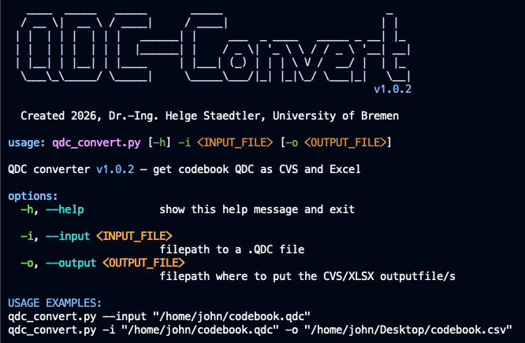
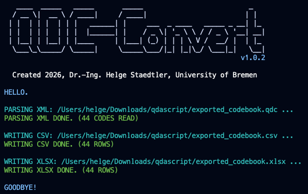
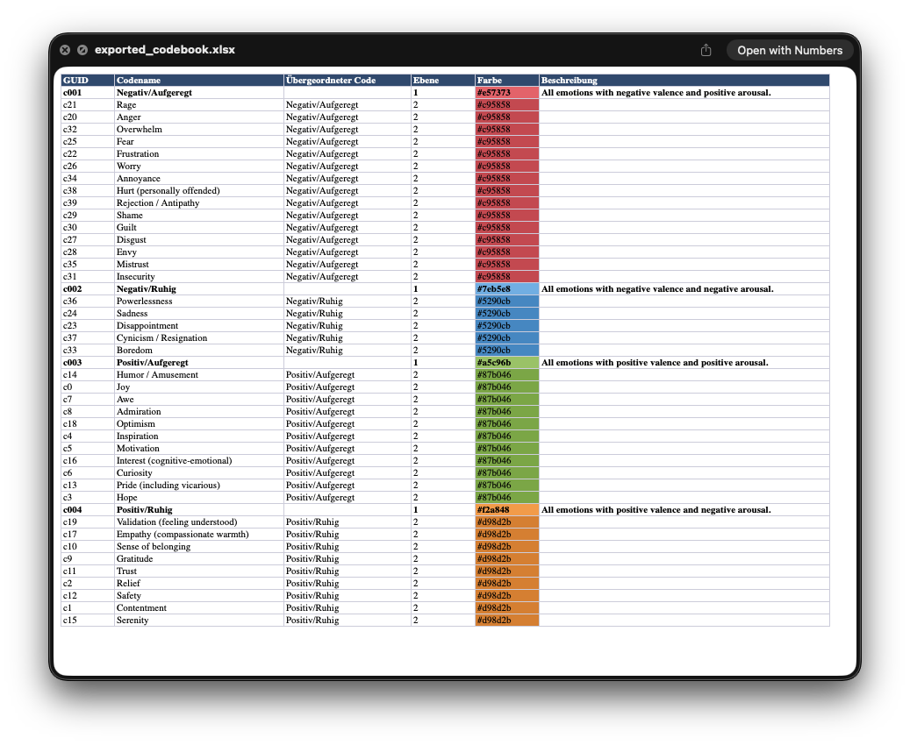
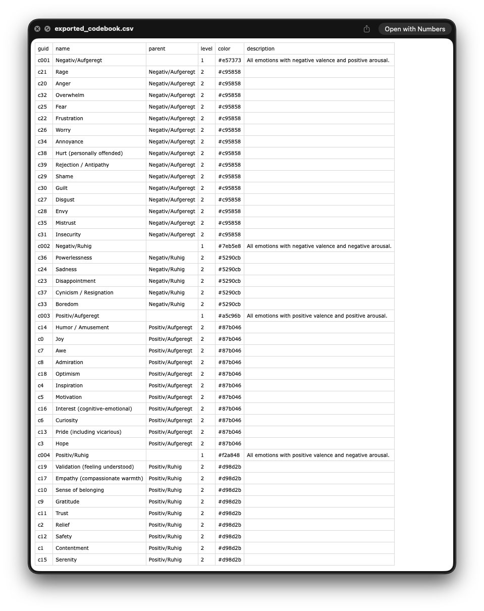

# OpenQDA Codebook Converter: QDC-Convert

You can convert codebooks from `.qdc` file format into `.csv` and `.xlsx` in case you need to.

## Installation

Following steps are needed to make the tool run based on Python.

### Python Virtual Environment (venv)

Create and activate a Python environment which carries the packages needed to run the tool.

```bash
python3 -m venv venv
source venv/bin/activate
```

### Install needed packages

We need some additional Python packages for reading XML and writing Excel files.

```bash
pip install -r requirements.txt
```

### Ready to run

Launch the tool with a `.qdc` file you would like to convert.

```bash
python qdc_convert.py --input "my_exported_codebook.qdc"
```

## Screenshots

Some screens showing you what you can expect.

### Help Screen



### Successful Conversion



### Result as Excel



### Result as CSV


